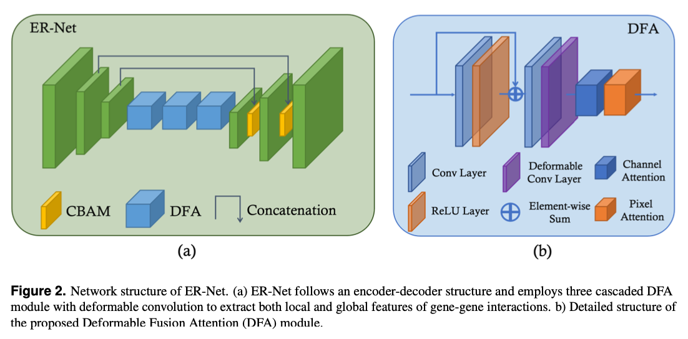

# Self-supervised deep learning of gene-gene interactions for improved gene expression recovery (TCER)
TCER is a self-supervised deep learning framework for gene expression recovery. The proposed pipeline consists of two steps, inluding (i) we first reposition the genes in such a way that their spatial configuration reflects their interactive relationships; and (ii) we then use a self-supervised 2D convolutional neural network (ER-Net) to extract the contextual features of the interactions from the spatially configured genes and impute the omitted values. 

# Paper
## Pipeline


## ER-Net Structure


# Code
## Requirement
```
torch==1.6.0+cu101
torchvision==0.7.0+cu101	
json5==0.9.6
matplotlib==3.4.3
ninja==1.10.2.2
pandas==1.3.3
scipy==1.7.1
seaborn==0.11.2
umap-learn==0.5.3
```
Since our network includes deformable convolution, please use the following command to set up the required environment. 
```
cd ./models
rm -r DCNv2
unzip DCNv2.zip
cd ./DCNv2
sh ./make.sh         # build
```
## Data
Please refer to the following Google Drive link to download the cellular taxonomy dataset with 0.5% efficiency loss. Notice that the provided data has already been constructed into GenoMap from the raw data.

https://drive.google.com/file/d/1H1tpwM96IR21qTKYF3EK5m6ziAVwUKIp/view?usp=share_link

### How to use the data?
```
data = loadmat('CellularTax_dataSAVER10-2000.mat')
train_genomaps = data["train_genoMaps"]   #  ==> w x h x c x #cells
train_genomaps_GT = data["train_genoMaps_GT"] # reference data for genomaps in the training set
test_genomaps = data["test_genomaps"] 
test_genomaps_GT = data["test_genomaps_GT"]  # reference data for genomaps in the test set
```
## Train
To train our ER-Net from scratch, please use the following command.
```
python train_genoMap.py --dataset 'CellularTax' --rate '10-2000' --epochs 50
```
## Test
To test the trained ER-Net, please use the following command.
```
python test_genoMap.py --dataset 'CellularTax' --rate '10-2000' --epoch_suffix 50 --model_path XXXX
```
You can alo download our trained model of the cellular taxonomy dataset with 0.5% efficiency loss for testing in the following Google Drive link.

https://drive.google.com/file/d/1xNwxv4MrJLEldvgFaqf7cJHakxmaPyDr/view?usp=share_link

## Visualization
The visualization tutorial could be found in the ```Visulization.ipynb``` file. 

Our imputation results and the corresponding cell types could be found in the following Google Drive link.

https://drive.google.com/drive/folders/1t84QTYd8DvfpE2z2XT1SzXT0LnrBY7p9?usp=share_link

